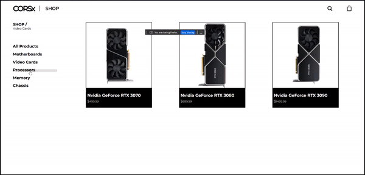

# Shopping Cart
I was tasked to make a simple shopping cart but I had to make a simple e-commerce website that will allow me to create a simple shopping cart with react.

## How It's Made:

**Tech used:** React, JSX, React Hooks

I wanted to get a better understanding of React and with this simple project I was able to get more practise with React. Understanding hooks was the main goal.

## Optimizations

After completing this project, I realised there were a lot of improvements I could do. With regard to JSX structure, I could have done a better job. In some of my state hooks, I could have used useEffect. I wish to organise my files and folders better. 

## Lessons Learned:

I was able to learn more about how to use hooks and how effective they can be. 